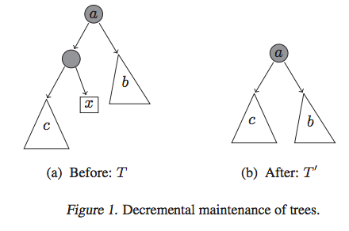

# Anomaly Detection

## Credit Card Fraud
Every year, billions of credit card transactions occur in the United States. While only a small portion of those are fraudulent, the results can be devastating is a fraudulent transaction is not discovered. Costs include damage to the customer, to the company, and to regulator agencies tasked with confirming validity of payments. 

## Anomaly Detection 
Today, your task is to design an anomaly detection system capable of automatically catching fraudulent transactions. You will have a variety of approaches to evaluate. On the one hand, you will have labeled data, so you can design a classification approach. On the other hand, given that fraudsters change their methods and tactics very quickly, you might want to consider an unsupervised approach. Begin with an unsupervised model, and move into a classified approach if you have extra time. 

## Your Data 
Create a Kaggle account and download your data from this location:
* https://www.kaggle.com/ntnu-testimon/paysim1 

You will have 182 MB of records, just over 6 million records with 11 columns. This data set is a simulation, designed to accelerate research for financial applications. Each record is a single transaction, marked as cash in, cash out, debit, credit, or transfer. Each transaction will also have the amount, the name of origin, etc.  Interestingly enough you'll have 2 target columns. One appears to be an indicator isFraud, which should be a manual label. Another is a flag based on a rule applied, that is, when a transaction has been attempted for over 200,000. 

Explore both columns. It is very common for companies in finance to be currently using a rules-based system, and exploring the move from a large and complex rules-engine towards a dynamically learning and scalable machine-driven system.

## Random Cut Forest 
The unsupervised algorithm you'll be exploring is Random Cut Forest. Intuitively, the model samples portions of your data and builds a small forest of trees. After training, inference can be performed on a single data element. If the tree changes beyond some learnable threshold, the data element is considered an anomaly. 

The data come provided to you in a single file. You will need to split them into a train, test, and validation set. Use the validation set extensively when optimizing your model, but rely on the test set only sparingly to determine the final evaluation report on your model.

Use the unsupervised RCF algorithm to find anomalies, and test your model based on the hold-out set. 

## Supervised Approaches 
After gaining headway in the unsupervised approach, consider a supervised method. Train an XGBoost and Linear Learner model. Run hyper-parameter tuning to understand the efficacy of those models for this scenario; is one model optimal? 

After trying multiple approaches, consider your feature engineering strategy. Are there any repeating customers? If there are, can you train a network to flag key players? Can you add a boolean indicator for those key players, and does it enhance or decrease your model performance?

# Starter Code 

* The dataset here is ready to use, so no starter code is necessary. 

# References

* Deep dive on Random Cut Forest
    * http://proceedings.mlr.press/v48/guha16.pdf 
* Paper introducing your simulated data set
    * https://www.researchgate.net/publication/313138956_PAYSIM_A_FINANCIAL_MOBILE_MONEY_SIMULATOR_FOR_FRAUD_DETECTION/download 

