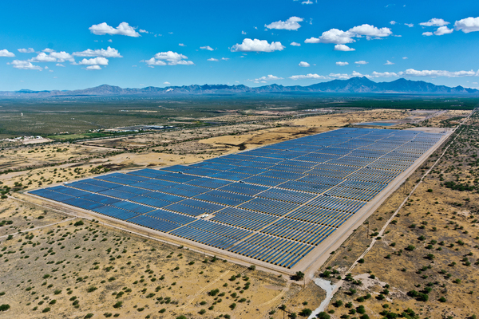
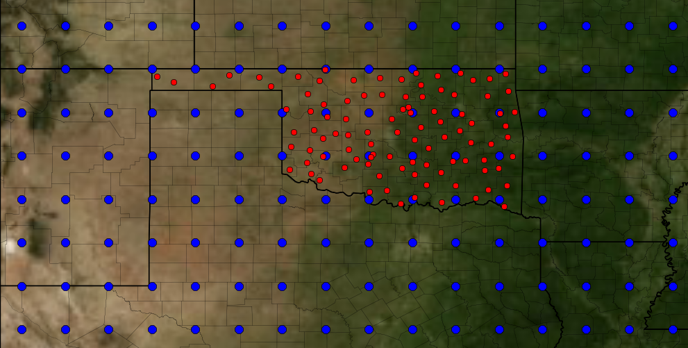
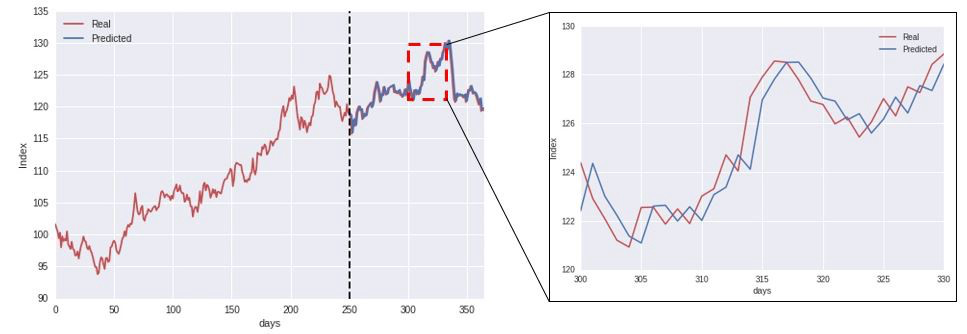

# Forecast Total Incoming Solar Energy at a Solar Farm

More than 2 gigawatts (GW) of photovoltaic solar capacity was installed in the U.S. during the second quarter of 2018, according to a recent report from Wood Mackenzie Power and Renewables and the Solar Energy Industries Association (SEIA). While this represents a 9 percent year-on-year decrease, the U.S. is still expected to more than double its photovoltaic capacity over the next five years.

Utility company *EnergyX* provides its customers with electricity that it generates using conventional fossil fuels and solar farms. Improved solar energy forecasting is a necessary component of making solar energy a viable alternative power source. Forecasting solar energy is critical to EnergyX because it offers electricity at a lower cost by switching to solar when incoming solar energy is high. However, incoming solar energy depends on various environmental factors such as latitude of the farm, cloud cover, presence of aerosol and pollution and time of day.  

EnergyX needs accurate forecasts of energy production in order to have the right balance of renewable and fossil fuels available. Errors in the forecast could lead to large expenses for the company from excess fuel consumption or emergency purchases of electricity from neighboring utilities. Power forecasts typically are derived from numerical weather prediction models, but statistical and machine learning techniques are increasingly being used in conjunction with the numerical models to produce more accurate forecasts. Currently, EnergyX uses a statistical technique called ARIMA, but is interested in exploring machine learning as an option. EnergyX, in partnership with the American Meteorological Society (AMS), is providing your team with sample data and a goal of producing highly accurate forecasts of incoming solar energy at one of their farms, shown below:

## Data Provided

Your team's goal is to explore machine learning techniques that provide the best short term predictions of solar energy production. You will predict the total daily incoming solar energy at 98 Oklahoma Mesonet (http://www.mesonet.org/) sites (shown in red above), which correspond to EnergyX's solar farms. Input numerical weather prediction data comes from the NOAA/ESRL Global Ensemble Forecast System (GEFS) Reforecast Version 2 (http://esrl.noaa.gov/psd/forecasts/reforecast2/). Data includes all 11 ensemble members and the forecast timesteps 12, 15, 18, 21, and 24. Locations of the Mesonet sites relative to the GEFS data are shown in the above figure. Training data will come from 1994-2007. 

*gefs_train.tar.gz* and *gefs_train.zip* contain all of the GEFS training data. The data are in netCDF4 files with each file holding the grids for each ensemble member at every time step for a particular variable. Each netCDF file contains the latitude-longitude grid and timestep values as well as metadata listing the full names of each variable and the associated units. More information about the netCDF format and links to open libraries for reading the files can be found here (http://www.unidata.ucar.edu/software/netcdf/). 

NetCDF libraries are known to be available for C, Java, Python, R, and MATLAB. Each netCDF4 file contains the total data *for one of the model variables* and are stored in a multidimensional array. The first dimension is the date of the model run and will correspond directly with a row in either the *train.csv* or *sampleSubmission.csv* files. The second dimension is the ensemble member that the forecast comes from. The GEFS has 11 ensemble members with perturbed initial conditions. The third dimension is the forecast hour, which runs from 12 to 24 hours in 3 hour increments. All model runs start at 00 UTC, so they will always correspond to the same universal time although local solar time will vary over each year. The fourth and fifth dimensions are the latitude and longitude uniform spatial grid. The longitudes in the file are in positive degrees from the Prime Meridian, so subtracting 360 from them will translate them to a similar range of values as in *station_info.csv*. A visualization of the grid can be seen on the main page. The table below describes the different variables in the dataset.

### Variable	Description	Units
apcp_sfc	3-Hour accumulated precipitation at the surface	kg m-2
dlwrf_sfc	Downward long-wave radiative flux average at the surface	W m-2
dswrf_sfc	Downward short-wave radiative flux average at the surface	W m-2
pres_msl	Air pressure at mean sea level	Pa
pwat_eatm	Precipitable Water over the entire depth of the atmosphere	kg m-2
spfh_2m	Specific Humidity at 2 m above ground	kg kg-1
tcdc_eatm	Total cloud cover over the entire depth of the atmosphere	%
tcolc_eatm	Total column-integrated condensate over the entire atmos.	kg m-2
tmax_2m	Maximum Temperature over the past 3 hours at 2 m above the ground	K
tmin_2m	Mininmum Temperature over the past 3 hours at 2 m above the ground	K
tmp_2m	Current temperature at 2 m above the ground	K
tmp_sfc	Temperature of the surface	K
ulwrf_sfc	Upward long-wave radiation at the surface	W m-2
ulwrf_tatm	Upward long-wave radiation at the top of the atmosphere	W m-2
uswrf_sfc	Upward short-wave radiation at the surface	W m-2

*train.csv* contains the total daily incoming solar energy in (J m-2) at 98 Oklahoma Mesonet (http://www.mesonet.org/) sites that have been in continuous operation since January 1, 1994. The solar energy was directly measured by a pyranometer at each Mesonet site every 5 minutes and summed from sunrise to 23:55 UTC of the date listed in each column.

*station_info.csv* contains the latitude, longitudes, and elevation (meters) of each Mesonet station.

*gefs_elevations.nc* is a netCDF4 file that contains the model elevations of the GEFS grid points. Since the model terrain is smoothed compared to the real-world, the true elevation at a particular lat-lon point will likely not match the elevation in the model. The file contains two elevation variables. The elevation_control variable contains the elevations for the GEFS control run, which is the first ensemble member. The elevation_perturbation variable contains the elevations for the GEFS perturbations, which are the other ensemble members. There are up to 300 m differences in the elevations, so using one instead of the other could have an impact on your model. NOTE: If you do include elevation-based interpolation into any submission since September 10 and in your final submission, it must use the elevations from gefs_elevations.nc and not from any outside source. You may download the data from https://www.kaggle.com/c/ams-2014-solar-energy-prediction-contest/data

The data scientists at EnergyX have the following notes for your team from their experience with this data so far:

## Classical Time-series Forecasting

### Components of a Time series

A time series can be thought of as having the following distinct components:

* *Level*: The average value in the series.
* *Trend*: The increasing or decreasing value in the series.
* *Seasonality*: The repeating short-term cycle in the series.
* *Noise*: The random variation in the series.

The observed value of the time series (in our current example, the incoming solar energy value) could be a combination of the above components. Take the following synthetic data as an example - the observed value is decomposed into the trend, seasonality and some residual noise. While you may predict the trend and the seasonality with high accuracy, residual noise is difficult to predict. It is safe to assume that the noise is not a major component of the total observed value (otherwise, you would be mainly predicting noise, which is impossible!). So, while exploring your data, thinking of these components may prove to be useful!
In the past, companies have used (and still use) statistical techniques like ARIMA, ARIMAX, SARIMA, Spectral Analysis and Decomposition, which all capture all the above four components. These techniques work well for short-term prediction, but do not prove to be effective for long term prediction or when the data available is large. ARIMA, for instance, gives more importance to immediate data points in the test set, but predicts larger variance in the predicted output for longer time scales. Also, These techniques are based on the notion that existing patterns in the time series will continue in the future as well. Recurrent Neural Networks  and other deep learning techniques have proven to be extremely effective for time series prediction problems.

## Deep Learning Forecasting Methods

### What is a Recurrent Neural Network?

A recurrent neural network (RNN) is a class of artificial neural network (https://en.wikipedia.org/wiki/Artificial_neural_network) where connections between nodes form a directed graph (https://en.wikipedia.org/wiki/Directed_graph) along a sequence. This allows it to exhibit temporal dynamic behavior for a time sequence. Unlike feedforward neural networks (https://en.wikipedia.org/wiki/Feedforward_neural_networks), RNNs can use their internal state (memory) to process sequences of inputs. Compared to other types of machine learning techniques, RNNs have shown superior performance with time series data. However, simpler types of models actually provide just as accurate predictions in many cases. Using models such as 
random forest (https://en.wikipedia.org/wiki/Random_forest), gradient boosting regressor (https://en.wikipedia.org/wiki/Gradient_boosting)and time delay neural networks (https://en.wikipedia.org/wiki/Time_delay_neural_network), temporal information can be included through a set of delays that are added to the input, so that the data is represented at different points in time. Try a statistical model or one of the above options in addition to the model you choose, just as a baseline. For a deep dive into understanding RNN, start with https://colah.github.io/posts/2015-08-Understanding-LSTMs/ and explore away!

The curse of Autocorrelation 

A predicted time series is said to have the property of autocorrelation if the predicted value of the next time step is very closely related to the current time step's value. Zooming into the the graph on the left shows the the observed values (red) and the predicted values (blue) are just offset by one time step. You do not need a machine learning model to achieve this; you only need the current time step's value!

Finally, inspect your data to see if certain features are more useful in predicting the output predicted variable (here, the incoming solar energy) than others. 

References

https://www.kaggle.com/c/ams-2014-solar-energy-prediction-contest/data
https://www.esrl.noaa.gov/psd/people/tom.hamill/SolarEnergyManuscript.pdf
http://coronalenergy.com/utilities
https://www.cnbc.com/2018/09/19/the-us-states-leading-the-way-in-solar.html
https://www.8minutenergy.com (https://www.8minutenergy.com/)
https://skymind.ai/wiki/lstm
https://towardsdatascience.com/the-fall-of-rnn-lstm-2d1594c74ce0
http://karpathy.github.io/2015/05/21/rnn-effectiveness/
